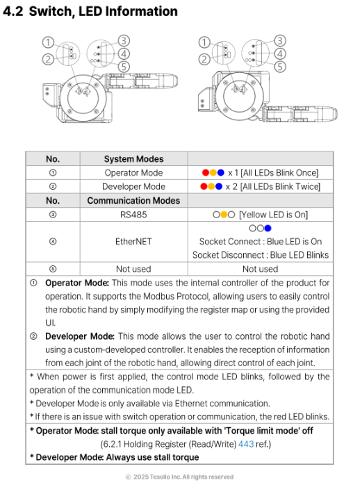

# dg5f_driver ROS 2 Package 🚀

## 📌 Overview

The `dg5f_driver` ROS 2 package provides a hardware interface leveraging [ros2_control](https://control.ros.org/) for the DG-5F grippers (Left/Right Hand), enabling direct robotic control operations.

## 📦 Dependency Installation

### Navigate to Workspace
```bash
cd ~/your_ws
```

### Update rosdep
```bash
apt update
rosdep update
```

### Install Specific Dependencies
```bash
rosdep install --from-paths src/DELTO_M_ROS2/dg5f_driver --ignore-src -r -y
```

### Verify Installation by Building
```bash
colcon build --packages-select dg5f_driver delto_hardware
```

## ⚠️ Before You Control: Notes

The dg5f_driver (ros2 control) operates in Developer Mode, which uses a custom protocol over Ethernet.
If the gripper is set to Developer Mode, please make sure that switches ② and ④ are in the correct positions, as shown in the attached image.

 

---

## 🚀 Launch Files

| Launch File | Description | Controller Type |
|-------------|-------------|-----------------|
| `dg5f_right_driver.launch.py` | DG5F Right Hand - JointTrajectoryController | Position (Trajectory) |
| `dg5f_left_driver.launch.py` | DG5F Left Hand - JointTrajectoryController | Position (Trajectory) |
| `dg5f_right_pid_controller.launch.py` | DG5F Right - 20 Individual PID Controllers | PID (Position→Effort) |
| `dg5f_left_pid_controller.launch.py` | DG5F Left - 20 Individual PID Controllers | PID (Position→Effort) |
| `dg5f_right_pid_all_controller.launch.py` | DG5F Right - Single Multi-Joint PID Controller | PID (Position→Effort) |
| `dg5f_left_pid_all_controller.launch.py` | DG5F Left - Single Multi-Joint PID Controller | PID (Position→Effort) |
| `dg5f_both_pid_all_controller.launch.py` | Both Hands - Single controller for each hand | PID (Position→Effort) |
| `dg5f_right_effort_controller.launch.py` | DG5F Right - Direct Effort Control | Effort (Direct) |
| `dg5f_left_effort_controller.launch.py` | DG5F Left - Direct Effort Control | Effort (Direct) |

---

## 🎛️ Controlling Delto Gripper-5F-RIGHT

### 1. Loading Delto-Gripper-5F-RIGHT controller (JointTrajectory)

Launch the Delto Gripper-5F-RIGHT controller with:
```bash
ros2 launch dg5f_driver dg5f_right_driver.launch.py delto_ip:=169.254.186.72 delto_port:=502
```

### 2. Loading Delto-Gripper-5F-RIGHT PID controller

For individual joint PID control (20 separate controllers):
```bash
ros2 launch dg5f_driver dg5f_right_pid_controller.launch.py delto_ip:=169.254.186.72
```

For multi-joint PID control (single controller managing all 20 joints):
```bash
ros2 launch dg5f_driver dg5f_right_pid_all_controller.launch.py delto_ip:=169.254.186.72
```

### 3. Test scripts:

| Script | Controller Type | Description |
|--------|-----------------|-------------|
| `dg5f_right_jtc_test.py` | JTC | JointTrajectory based test |
| `dg5f_right_pid_test.py` | PID | Individual joint PID test |
| `dg5f_right_pid_all_test.py` | PID All | All joints PID test |

```bash
ros2 run dg5f_driver dg5f_right_jtc_test.py
```

---

## 🎛️ Controlling Delto Gripper-5F-LEFT

### 1. Loading Delto-Gripper-5F-LEFT controller (JointTrajectory)

Launch the Delto Gripper-5F-LEFT controller with:
```bash
ros2 launch dg5f_driver dg5f_left_driver.launch.py delto_ip:=169.254.186.73 delto_port:=502
```

### 2. Loading Delto-Gripper-5F-LEFT PID controller

For individual joint PID control (20 separate controllers):
```bash
ros2 launch dg5f_driver dg5f_left_pid_controller.launch.py delto_ip:=169.254.186.73
```

For multi-joint PID control (single controller managing all 20 joints):
```bash
ros2 launch dg5f_driver dg5f_left_pid_all_controller.launch.py delto_ip:=169.254.186.73
```

### 3. Test scripts:

| Script | Controller Type | Description |
|--------|-----------------|-------------|
| `dg5f_left_jtc_test.py` | JTC | JointTrajectory based test |
| `dg5f_left_pid_test.py` | PID | Individual joint PID test |
| `dg5f_left_pid_all_test.py` | PID All | All joints PID test |

```bash
ros2 run dg5f_driver dg5f_left_jtc_test.py
```

---

## 🤲 Controlling Both Hands

### Launch both hands with PID control:
```bash
ros2 launch dg5f_driver dg5f_both_pid_all_controller.launch.py \
    dg5f_right_ip:=10.10.20.72 dg5f_left_ip:=10.10.20.73
```

---

## 🔧 Controller Types

### 1. JointTrajectoryController (Default)
- **Purpose**: Smooth trajectory interpolation for position control
- **Use Case**: When you need smooth, coordinated finger movements
- **Input**: Trajectory with multiple waypoints
- **Topic**: `/<namespace>/delto_controller/joint_trajectory`

### 2. PID Controller (Position → Effort)
- **Purpose**: Position control with effort output using PID feedback loop
- **Use Case**: Force-sensitive grasping, compliance control
- **Input**: Single position reference value
- **Individual**: 20 separate PID controllers for each joint (`*_pid_controller`)
- **Multi-Joint**: Single controller managing all joints (`*_pid_all_controller`)
- **Topic**: `/<namespace>/rj_dg_pospid/reference` (for multi-joint)

### 3. Effort Controller (Direct)
- **Purpose**: Direct effort/torque control without position feedback
- **Use Case**: Direct force control, impedance control
- **Input**: Direct effort values for each joint
- **Topic**: `/<namespace>/effort_controller/commands`

### ForceTorqueSensorBroadcaster
- **Purpose**: Publish fingertip force/torque data
- **Sensors**: 5 fingertip F/T sensors per hand
- **Topic**: `/<namespace>/fingertip_<n>_ft_sensor/wrench`

---

## 🌐 Namespaces

All drivers use namespaces to avoid topic conflicts when running multiple grippers:

| Driver | Namespace |
|--------|-----------|
| DG5F Right | `/dg5f_right/` |
| DG5F Left | `/dg5f_left/` |
| DG5F Both | `/dg5f_both/` |

---

## 🤝 Contributing
Contributions are encouraged:

1. Fork repository
2. Create branch (`git checkout -b feature/my-feature`)
3. Commit changes (`git commit -am 'Add my feature'`)
4. Push (`git push origin feature/my-feature`)
5. Open pull request

## 📄 License
BSD-3-Clause

## 📧 Contact
[TESOLLO SUPPORT](mailto:support@tesollo.com)

